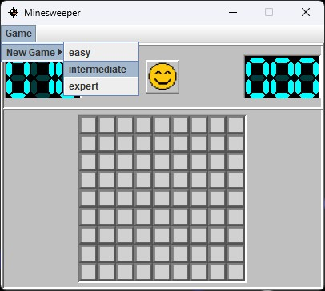
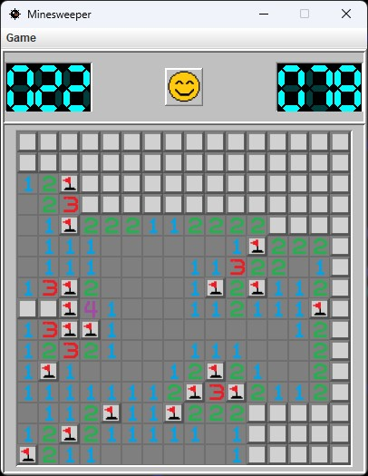
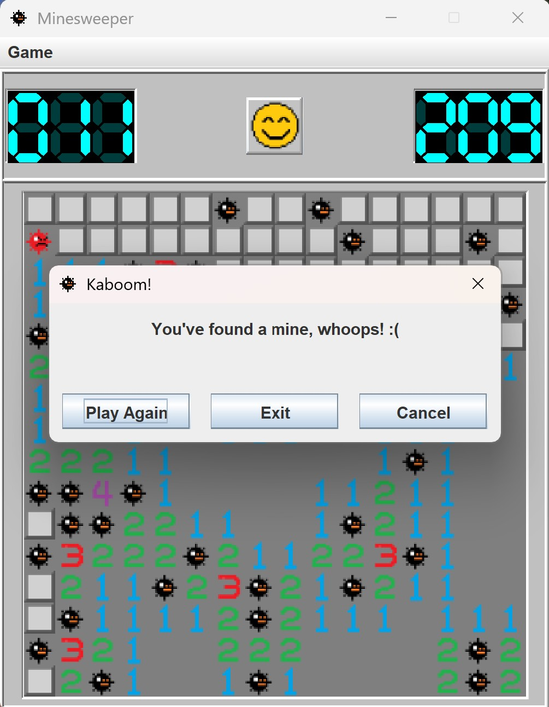
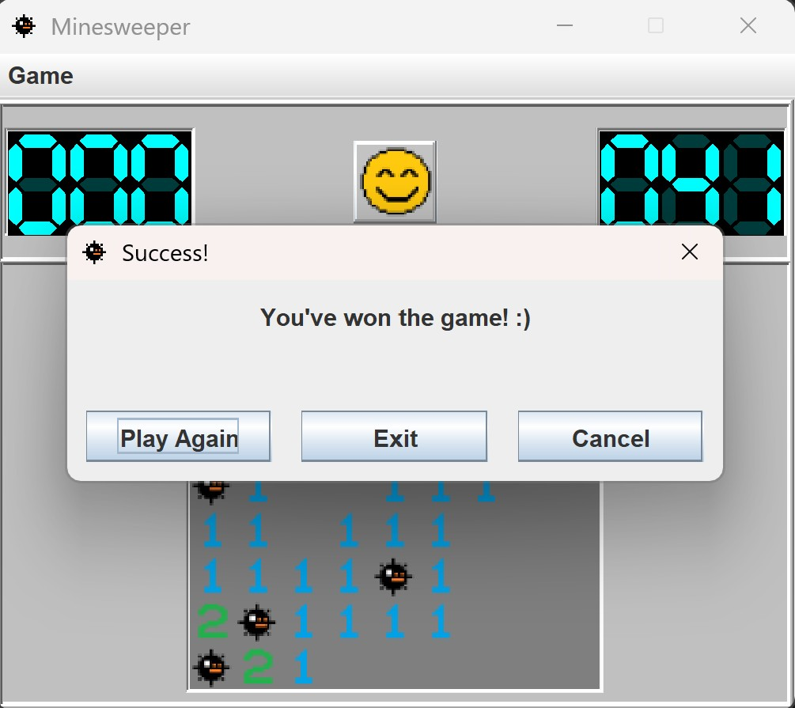

## About this project

My main goal here was to practice MVC design pattern, OOP concepts, and make a faithful recreation of the classic game, Minesweeper!

## How to play

| Platform | Install |
| -------- | ------- |
|   Windows | [Windows Installer](https://github.com/zezmo/Minesweeper/releases/latest/download/Minesweeper-Windows.exe)  [Windows Portable](https://github.com/zezmo/Minesweeper/releases/latest/download/Minesweeper-Windows-Portable.zip)       |
|   macOS | [macOS drag and drop install](https://github.com/zezmo/Minesweeper/releases/latest/download/Minesweeper-macOS.dmg) [macOS Portable](https://github.com/zezmo/Minesweeper/releases/latest/download/Minesweeper-macOS-Portable.zip)       |
|   Linux | [Linux deb](https://github.com/zezmo/Minesweeper/releases/latest/download/Minesweeper-Linux.deb) [Linux tar.gz](https://github.com/zezmo/Minesweeper/releases/latest/download/Minesweeper-Linux-Portable.tar.gz)       |

 

[All releases](https://github.com/zezmo/Minesweeper/releases)

## Features:
- Three difficulty modes
- 7 segment display for timer and mines remaining
- Flood fill zeros
- Quick restart
- Custom icons
- First click is always a zero

## What I Learned:
- Deepen object oriented programming knowledge
- MVC design pattern

## Screenshots

    
    

    
    

    
    

